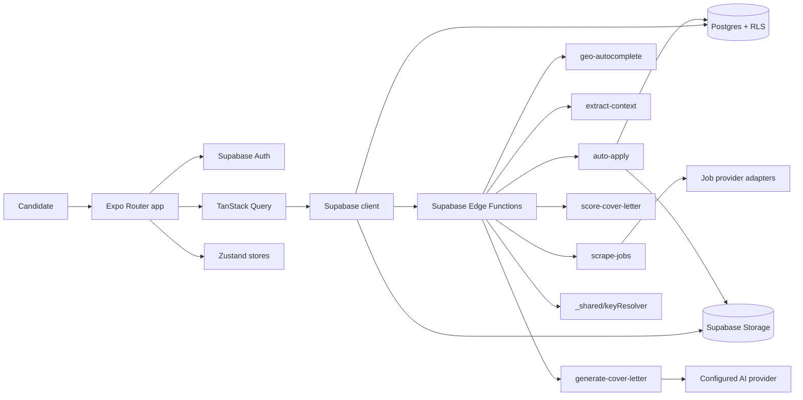
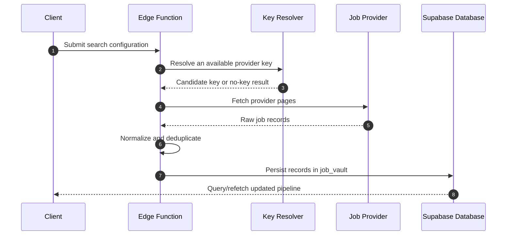
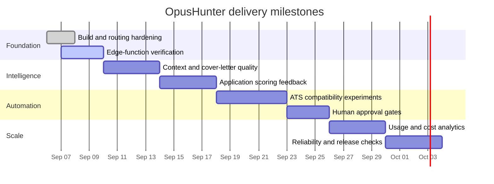

<div align="center">
  

  # OpusHunter

  **A cross-platform job discovery, triage, and application workspace.**

  OpusHunter helps candidates collect relevant jobs, organize their pipeline,
  generate tailored cover letters, and keep application assets in one place.

  <p>
    <a href="https://expo.dev"></a>
    <a href="https://reactnative.dev"></a>
    <a href="https://supabase.com"></a>
    <a href="https://www.typescriptlang.org"></a>
  </p>
</div>

---

## Product vision

Job searching is usually split across job boards, notes, documents, browser tabs,
and manually written applications. OpusHunter is being built as a single,
privacy-conscious workspace around that process:

```text
Discover  →  Understand  →  Prioritize  →  Prepare  →  Apply  →  Learn
   │             │              │             │          │        │
   └─ sources   └─ job data     └─ pipeline   └─ AI      └─ link  └─ future analytics
```

The long-term goal is not blind automation. It is **controlled automation**:
the candidate remains in charge of what is selected, what is generated, and
what is submitted.

## What works today

- Cross-platform Expo app targeting Android, iOS, and web.
- Supabase authentication with email/password and Google OAuth flows.
- Profile setup and candidate configuration.
- Job ingestion through Supabase Edge Functions and provider adapters.
- Job normalization and duplicate protection before records enter the job vault.
- Job pipeline views with triage-oriented cards and status management.
- Cover-letter generation through the `generate-cover-letter` Edge Function.
- Cover-letter viewing, editing, copying, sharing, regeneration, and job-link
  opening.
- Routed application preparation at `/apply/[id]` with readiness checks,
  primary-CV and cover-letter visibility, and a preserved direct website-link
  action.
- Editable candidate contact fields including phone, LinkedIn, GitHub,
  portfolio, and a candidate-controlled application email.
- Multi-select seniority targeting is stored in `profiles.seniority_levels`;
  the legacy `seniority_level` remains as the primary compatibility value.
- Resume/document workflows backed by Supabase Storage.
- Geo autocomplete through the `geo-autocomplete` Edge Function.
- User API-key and shared-key resolution through the shared key resolver.
- Admin surfaces for users and API-key management, protected by server-side
  role checks.
- Android preview APK builds through EAS. The clean preview build was verified
  successfully after making `babel-preset-expo` an explicit dependency.

## Current boundaries

The following are intentionally not described as finished:

- Fully unattended ATS form submission is not yet a general production
  capability.
- The fast-apply roadmap is provider-specific and candidate-reviewed. An
  unsupported or unknown ATS must use the manual handoff path; opening a
  website is never recorded as a submitted application.
- The linked Gmail/Outlook account is separate from the OpusHunter login
  identity and must be explicitly selected and approved for email dispatch.
- Candidate contact columns can be installed directly from
  `supabase/sql/candidate-contact-fields.sql` in the Supabase SQL Editor,
  including `application_email` and `seniority_levels`.
  Regenerate `types/database.types.ts` after running it.
- Provider coverage and provider quotas vary by configured API keys.
- Cost analytics and per-provider token accounting are planned, not complete.
- Application outcomes and feedback loops are not yet a complete optimization
  system.
- The application flow should be treated as candidate-reviewed until the
  upcoming verification work is complete.

### Email-linking callback configuration

Gmail linking uses an authorization-code exchange. Register the exact callback
URI in the Google OAuth Web client:

- Local web: `http://localhost:8081`
- Deployed web: the exact deployed origin, such as
  `https://your-vercel-domain.example`
- Native builds: `opushunter://oauth/callback`

For a fixed deployed callback, set
`EXPO_PUBLIC_WEB_OAUTH_REDIRECT_URI=https://your-real-domain.example` in the
Vercel/EAS environment and add that exact value to Google. If this variable is
not set, web uses the origin currently shown in the browser.

The Email Accounts screen displays the URI the app is currently using. The
same value is sent to Google and to the `oauth-link-email` Edge Function. Do
not add an extra slash or `/oauth/callback` to a web origin. The Google Web
client must also have the Gmail API enabled and the requested `gmail.send`
scope approved for the project.

---

## Architecture



### Request lifecycle



### Data protection model

```text
Client
  │
  ├── authenticated Supabase session
  ├── public application data permitted by RLS
  └── Edge Function calls for privileged operations
          │
          ├── service-role database access
          ├── provider-key resolution
          ├── document/context processing
          └── server-side role and ownership checks
```

RLS remains the primary database boundary. Service-role operations are kept in
Edge Functions rather than exposed to the client. Secrets must be supplied
through the local environment or the EAS environment; never commit them.

---

## Feature areas

### Job discovery and location

The `scrape-jobs` function coordinates provider adapters for job collection,
normalization, pagination, and deduplication. The current adapter directory is:

```text
supabase/functions/scrape-jobs/
├── index.ts
└── adapters/
    ├── adzuna.ts
    ├── jobtech.ts
    └── thehub.ts
```

`geo-autocomplete` provides location suggestions and the client sends the
selected search parameters to the scraper.

### Pipeline and triage

The authenticated dashboard exposes the job pipeline, cards, filtering, and
status changes. Local UI state is held in the stores under `stores/`; server
state and refetching are handled with TanStack Query.

### Candidate assets and AI drafting

Candidate documents are stored in Supabase Storage. Context extraction and
cover-letter generation use the candidate's configured information and the
selected job. Generated letters are stored in `cover_letters` and can be
reviewed before the candidate opens the external application URL.

The document vault keeps uploaded resumes immutable. Resume refinement sends the
source PDF/DOCX plus verified profile/context evidence to the `refine-resume`
Edge Function, which returns an evidence-grounded draft, an improvement
summary, warnings, and ATS checks. A refined version is only persisted as a
separate PDF after the candidate reviews and exports it; it is never made
primary automatically. The vault supports opening/downloading the original or
refined artifact, sharing on native devices, and explicitly choosing either
version for applications. Unsupported or ambiguous facts are omitted or
flagged rather than invented.

The refinement is intentionally two-track: the original visual CV is retained
for human-facing applications, while the generated version is a restrained
single-column, text-first PDF for ATS-heavy workflows. It evaluates common ATS
risks such as columns, sidebars, photos, icon-only contact details, low
contrast, decorative color, unusual fonts, tables, and text embedded in
graphics. It does not claim that any ATS can be predicted perfectly.

“Quick application” currently means candidate-controlled preparation, not
silent universal auto-submit. The application screen checks identity, the
primary CV, application email, and optional cover letter; the candidate reviews
the materials, confirms a handoff, and then opens the employer’s real
application URL. Provider-specific autofill or email submission must be added
only behind verified adapters and an explicit final approval step.

### Administration

The admin area includes user and API-key management. It is not a substitute
for database security: authorization must continue to be enforced in the Edge
Functions and database policies.

---

## Repository map

```text
OpusHunter/
├── app/
│   ├── _layout.tsx                         Root providers and auth redirect
│   ├── (auth)/                             Authentication and onboarding
│   └── (tabs)/
│       ├── _layout.tsx                     Authenticated shell
│       └── (dashboard)/
│           ├── index.tsx                   Dashboard home
│           ├── pipeline.tsx                Job pipeline and triage
│           ├── rules.tsx                   Search/rule configuration
│           ├── admin/                      Admin dashboard and controls
│           └── settings/                   Profile and document vault
├── components/                             Reusable UI and feature components
├── constants/                              Theme and animation tokens
├── hooks/                                  Client hooks
├── lib/                                    Supabase, navigation, query helpers
├── stores/                                 Auth, jobs, UI, and pipeline state
├── types/                                  Application and generated DB types
├── supabase/
│   ├── migrations/                         Database migrations
│   └── functions/
│       ├── _shared/                        Auth, CORS, rate limits, key logic
│       ├── auto-apply/
│       ├── extract-context/
│       ├── generate-cover-letter/
│       ├── geo-autocomplete/
│       ├── oauth-link-email/
│       ├── refine-resume/
│       ├── save-api-key/
│       ├── score-cover-letter/
│       └── scrape-jobs/
├── app.json                               Expo configuration
├── eas.json                               EAS build profiles
├── metro.config.cjs                       Metro + NativeWind + Reanimated
├── package.json                            Scripts and dependencies
└── pnpm-lock.yaml                          Reproducible dependency graph
```

Expo Router route groups such as `(auth)`, `(tabs)`, and `(dashboard)` organize
the filesystem without appearing in the public URL. When adding a dynamic
screen, the filename must include the parameter, for example `[id].tsx`.

---

## Technology stack

| Area | Technology |
| --- | --- |
| Client | Expo SDK 57, React Native 0.86.3, React 19.2.3 |
| Routing | Expo Router 57 |
| Styling | NativeWind 4, Tailwind CSS 3 |
| Motion | Reanimated 4, React Native Worklets |
| UI state | Zustand |
| Server state | TanStack Query |
| Backend | Supabase Auth, PostgreSQL, Storage, Edge Functions |
| Edge runtime | Deno |
| AI integration | Provider-backed Edge Function workflows |
| Android delivery | EAS preview APK / production builds |
| Package manager | pnpm |

---

## Local development

### Requirements

- Node.js 20 or newer
- pnpm 11 or compatible
- A linked Supabase project for Edge Function and database work
- Expo/EAS access for device builds

### Install and run

```bash
pnpm install
pnpm start
```

Useful commands:

```bash
pnpm run typecheck       # TypeScript validation
pnpm run lint            # Expo ESLint entry point
pnpm run build:web       # Web export
pnpm run android         # Local native Android run
pnpm run metro:clear     # Start Metro with a clean cache
```

### Environment

Create a local `.env` file with the values required by the client and Edge
Functions. Keep service-role keys and provider secrets server-side. Public
Expo variables should use the `EXPO_PUBLIC_` prefix only when they are safe to
ship to the client.

### Supabase functions

```bash
npx supabase functions serve
npx supabase functions deploy <function-name>
```

Use the linked project and migrations as the source of truth for database
changes. Regenerate client types after schema changes:

```bash
pnpm run supabase:gen-types
```

---

## Android builds

The preview profile produces an internal APK:

```bash
npx eas-cli@latest build \
  --profile preview \
  --platform android \
  --clear-cache
```

The release JavaScript bundle must be able to resolve `babel-preset-expo`.
It is intentionally declared directly in `devDependencies` so pnpm's isolated
dependency layout and the EAS worker resolve the Babel configuration
consistently.

Profiles are defined in `eas.json`:

```text
development → internal development client APK
preview     → internal preview APK
production  → store-ready Android App Bundle
```

---

## Milestones

The roadmap is deliberately staged: reliability and observability come before
larger automation. Dates are sequence markers for the coming days, not promises
of a feature being production-ready before its verification gate.



### Milestone 1 — Harden the foundation

- Keep Android preview and production builds reproducible.
- Align filesystem routes with every navigation target.
- Remove dead duplicate implementations without changing active behavior.
- Add focused checks for Edge Function imports, dynamic routes, and ownership.

### Milestone 2 — Make the AI workflow dependable

- Improve extraction quality for resumes and certifications.
- Add structured generation contracts and clearer failure states.
- Score generated letters with explainable signals.
- Preserve candidate edits and make regeneration intentional and reversible.

### Milestone 3 — Build responsible application automation

- Detect supported ATS providers rather than assuming compatibility.
- Introduce a preview of every proposed field before submission.
- Add explicit candidate approval gates.
- Capture submission evidence, status, and failure reasons.

### Milestone 4 — Operate it like a real product

- Track provider usage, quotas, latency, and estimated cost.
- Add crash/error reporting and actionable operational logs.
- Expand provider adapters behind a shared normalization contract.
- Establish release checks for Android, web, database migrations, and Edge
  Functions.

---

## Engineering principles

1. **Truthful status:** documentation must distinguish shipped behavior from
   planned behavior.
2. **Candidate control:** generated or submitted content requires visible,
   understandable approval boundaries.
3. **Server-side trust boundaries:** client parameters never replace auth,
   ownership, or role checks.
4. **Small, reversible changes:** protect working flows and validate before
   broad refactors.
5. **Observable automation:** every external call should have a useful outcome,
   error path, and usage story.

## License

All rights reserved by the project owner unless a repository policy states
otherwise.
# Provider application submission

Application submission is intentionally provider-scoped and truthful. The app
can submit a Greenhouse listing only through the `submit-application` Edge
Function, after the candidate confirms and the deployment has the
employer-authorized `GREENHOUSE_JOB_BOARD_API_KEY` secret configured. The
function loads the authenticated user's primary extracted CV, profile, and
listing-specific cover letter, retrieves the Greenhouse job questions, blocks
submission when required custom answers are missing, and records the provider
response in `job_applications`. It never stores the API key or document
contents in the audit record.

Lever direct submission is not enabled by default. Lever's authenticated API
requires an employer-authorized integration, so Lever listings remain
candidate-controlled: the app prepares the materials and opens the real
employer form. Unsupported ATSs are handled the same way and are never shown
as successfully submitted.
