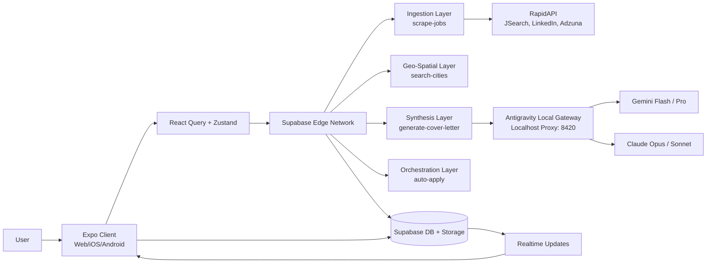
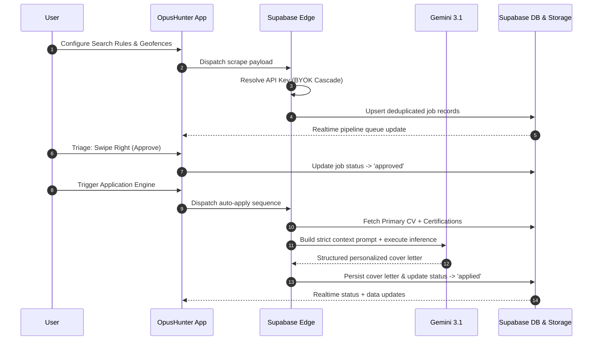

<div align="center">
  
  <h1>OpusHunter 🎯</h1>
  <p><strong>Autonomous Cross-Platform Job Application Engine & Local AI Gateway</strong></p>
  <p><i>Engineered for the future of work. Stop hunting. Let OpusHunter do it for you.</i></p>

  <p>
    <a href="https://expo.dev"></a>
    <a href="https://reactnative.dev"></a>
    <a href="https://supabase.com"></a>
    <a href="#trilateral-system-architecture"></a>
  </p>
</div>

---

## 🏗️ Trilateral System Architecture

OpusHunter operates through three integrated, highly segregated layers working in orchestration to deliver secure data ingestion, fast local state synchronization, and high-fidelity client interactions.

### The Network Topology




- **Inference & Orchestration Layer (Backend):** 11 dedicated Deno-based Supabase Edge Functions orchestrate job scraping, Gmail OAuth linking, resume ATS-quality extraction, and automated applying. High-context LLM payloads are routed dynamically via a local Antigravity Gateway (Port 8420) to bypass strict provider quotas.
- **State & Motion Layer (Frontend Client):** An adaptive Expo Router v57 and React Native 0.86 client compiling to iOS, Android, and Web from a unified source of truth. Handles complex UI caching via TanStack Query and utilizes a lightweight Zustand store for high-throughput layout manipulation, rendering interactive 120fps swipeable triage decks and ambient animation loops directly on the native UI thread.
- **Cryptographic Persistence Layer (Database & Storage):** Powered by PostgreSQL in Supabase. Ensures ironclad multi-tenant isolation using Row-Level Security (RLS) policies on all tables. Personal assets (CVs, cover letters, certifications) are cryptographically stored, while sensitive items like third-party Gmail OAuth tokens are locked behind Service-Role-only visibility, preventing direct client exposure.

---

## 🛡️ Core Pillars (Technical Moats)

| Pillar                            | Technical Implementation                                                                                                                                                                                | Strategic Benefit                                                                                                                                           |
| :-------------------------------- | :------------------------------------------------------------------------------------------------------------------------------------------------------------------------------------------------------ | :---------------------------------------------------------------------------------------------------------------------------------------------------------- |
| **Intelligent Context Synthesis** | Aggregates user CVs, certifications, and active JSearch job descriptions into structured Deno-side prompt templates, parsed strictly into structured JSON payloads via Google Gemini 3.1 Flash.         | Eliminates generic, low-relevancy applications. Maximizes organic applicant-to-job matching score and adapts to different ATS scanning algorithms natively. |
| **Triple-Tier Key Resolution**    | A unified `keyResolver.ts` module cascade resolving API keys in sequence: User BYOK profiles check → Admin Shared Key Pool with fair `last_used` rotation → Environment Secrets.                        | Maximizes global service uptime and provides zero platform overhead for heavy power-users, shifting processing costs away from the system owner.            |
| **Service-Role Isolation**        | Third-party credentials, SMTP settings, and Gmail OAuth refresh tokens are written to system-restricted tables with no public SELECT policies. Interfaced strictly via `SECURITY DEFINER` RPC triggers. | Establishes bank-grade data security. Eliminates risk of token leaking, client-side reverse engineering, or arbitrary credential exfiltration.              |
| **Ambient Physics Engine**        | Animates heavy backdrop fluid gradients and gesture-driven Tinder decks entirely on the native UI thread via React Native Reanimated Worklets, bypassing React's main JS thread.                        | Ensures consistent, fluid 120fps UI performance on both budget mobile devices and web browsers, eliminating layout-tear and JSE lag.                        |

---

## 🚀 Key Features

### 🏦 Ingestion & Location Services (Backend Orchestration)

- **High-Throughput Aggregator:** Real-time job ingestion powered by JSearch (RapidAPI) normalization, delivering automated deduplication and schema alignment.
- **Global Geospatial Autocomplete:** Interactive location autocompletion using GeoDB Cities, fully proxied through a Deno-based edge function with rate-limit buffers and automated geolocation fallbacks.
- **BYOK Fallback Architecture:** Resilient, multi-tier API rotation that gracefully handles `429 Too Many Requests` by instantly cycling key candidates in the admin pool.

### 💼 Cognitive Synthesis (Asset Engine)

- **Deep Context Extraction:** Multi-document contextual synthesis combining primary resumes, specialized certifications, and active target job roles.
- **Adaptive Cover-Letter Generation:** Instant, tailored cover-letter generator configured to the applicant's choice of professional tone, key highlights, and career trajectory.
- **Binary Stream Vaulting:** Native CV uploads bypass heavy Base64 parsing, streaming directly to Supabase Storage via `ArrayBuffer` payloads, eliminating mobile V8 heap crashes.

### 🤖 Client Terminal & Surveillance (UI/UX)

- **Unified Layout Engine:** A single routing definition (`lib/navConfig.ts`) driving both desktop sidebar drawers and mobile floating tab layouts seamlessly.
- **120fps Gesture Triage:** Interactive, physics-based swipe decks and Kanban boards compiled to native platform threads.
- **Admin Control Center:** Premium administrative fleet dashboard containing user roles mutation grids, live shared API-key management, and system routing gates.

---

## 🛠️ Technology Stack

| Component            | Technology                | Version         | Purpose                                                 |
| :------------------- | :------------------------ | :-------------- | :------------------------------------------------------ |
| **Frontend Shell**   | Expo SDK                  | ~57.0.19       | Cross-platform build system & SDK orchestration         |
| **Router**           | Expo Router               | ~57.0.14        | Typed filesystem-based routing schema                   |
| **UI Core**          | React Native / React      | 0.86.2 / 19.2.3 | Native UI engine and layout shell                       |
| **Styles**           | NativeWind / Tailwind CSS | 4.2.5 / 3.4.19  | Utility-first compilation across Native and Web targets |
| **Motion**           | Reanimated / Worklets     | 4.5.1 / 0.10.1  | UI-thread isolated physics and gestures                 |
| **Local State**      | Zustand                   | 4.5.2           | High-performance ephemeral client-side state            |
| **Server State**     | TanStack Query            | 5.28.0          | Cache management, optimistic mutations, and refetches   |
| **Inference Engine** | Gemini Flash Lite         | 3.1             | Micro-cost semantic analysis and document drafting      |
| **Database**         | PostgreSQL (Supabase)     | 16              | ACID-compliant state, relational tables, and RLS        |
| **Edge Compute**     | Deno Runtime              | Latest          | Secure, isolated edge functions serving routing logic   |
| **Storage**          | Supabase Storage          | v2              | RLS-enforced static document hosting (resumes/PDFs)     |

---

## 🎨 Design System & Motion Tokens

OpusHunter is governed by a precise, WCAG AAA-compliant visual palette structured strictly in `lib/theme.ts`.

- **Accessibility Compliance:** Contrast ratios are strictly evaluated against backdrops (Brand Accents achieve 8:1+ contrast ratios, secondary accents maintain 4.5:1 minimums).
- **Color Hierarchy:**
  - **Brand Accents:** Cyan (`#22D3EE`), Purple (`#8B7CF6`), Rose/Pink (`#F0466E`).
  - **Surfaces:** Core Background (`#0A0714`), Surface Obsidian (`#120D1E`), Frosted Card (`#0D0914`).
- **Motion Physics:** Fast UI micro-interactions are tuned between `150ms` and `300ms` with precise spring physics. Idle ambient background animations drift on long-running `8000ms` non-blocking UI thread loops.

---

## 🔒 Security & Performance Practices

- **Zero-Trust Hydration Guards:** Specialized `isMounted` state locks block React 19 from mismatched DOM representation across Server-Side Rendered (SSR) Web layouts and Native client mounts.
- **Data Sovereignty:** OAuth tokens and personal API keys reside exclusively in strict Service-Role Postgres tables. Direct database rows are invisible to standard client select queries.
- **Dynamic Binary Buffering:** Files and resumes stream directly into Supabase Storage as native binary arrays, preventing heavy Base64 strings from choking V8 memory allocations.
- **Strict Role Verification:** Administrative layouts and API modifications are protected by `SECURITY DEFINER` Postgres procedures, validating clearance on the server rather than trust-bound client parameters.

---

## 🎯 Lifecycle, Status & Roadmap

### 🔍 Honest Engineering Disclosures (Current Status)

This section is actively updated to prevent reverse-engineering of project progress.

- **Unified Cross-Platform Navigation:** Driven by a single config source (`lib/navConfig.ts`).
- **Identity Resolution:** Unified email/password and Google OAuth fully active via Supabase.
- **Target Scraper Engine:** Powered exclusively by JSearch (RapidAPI). Multi-source scraping is not yet implemented.
- **Auto-Apply Execution:** Automated application generation operates as a highly personalized cover-letter draft creator and hard-link dispatcher. Playwright-based automated form filing on ATS platforms (Greenhouse/Lever) remains to be confirmed.
- **API Cost Analytics:** The Admin panel manages active shared API keys but does not currently log specific tokens consumed or monthly costs.

### 🚀 (Strategic Roadmap) WHEN we made sure everythign else works

1. **Apply Service Verification:** Validate Playwright's headless execution state and synchronize auto-submission capability with the UI.
2. **Cost & Usage Surveillance:** Deploy an `api_key_usage_logs` schema, capture Gemini's exact `usageMetadata` tokens, and render real-time cost-tracking statistics inside the Admin Panel.
3. **Multi-Source Scraping Expansion:** Add Adzuna as a free secondary job-ingestion partner to prevent JSearch API quota exhaustion.
4. **Reliability Infrastructure:** Implement unit testing suites for `keyResolver.ts` and scrape-normalization triggers, and integrate Sentry crash reporting.

---

## 🏗️ Project Structure

```text
opushunter/
├── app/                                  Expo Router — file path IS the route
│   ├── _layout.tsx                       Root Stack: mounts AmbientBackground, wires (auth)/(tabs)/admin
│   ├── index.tsx                         Root "/" — session check, redirects to login or dashboard
│   ├── (auth)/                           Unauthenticated flow — email/password + Google OAuth
│   ├── (tabs)/                           Authenticated shell
│   │   ├── dashboard.tsx                 Pipeline view — scraped jobs queue, swipe-to-decide, metrics
│   │   ├── jobs.tsx                      Job list/detail
│   │   ├── configure.tsx                 Renders ConfigureScreen (Engine/Rules tabs)
│   │   └── settings/                     Settings home, security, documents (CV vault), profile
│   └── admin/                            Server-verified role gate; dashboard, users, api-keys
├── components/
│   ├── features/configure/               The single Configure-screen implementation
│   ├── onboarding/SetupWizard.tsx        First-run five-step guided setup
│   ├── pipeline/                         SwipeableJobCard, JobDetailModal
│   ├── layout/                           AdaptiveLayout (Sidebar), AmbientBackground (live), PageContainer
│   ├── charts/                           BarChart, DonutChart (SVG, no extra dependency)
│   └── ui/                               GlassCard, AnimatedPressable, ProfileDropdown, etc.
│       └── ⚠ AmbientBackground.tsx — dead duplicate of layout/AmbientBackground.tsx, pending deletion
├── hooks/                                useCVVault, useEdgeScraper, useCitySearch
├── store/usePipelineStore.ts             Zustand — job queue + pipeline metrics, no Supabase calls
├── lib/
│   ├── supabase.ts                       Supabase client
│   ├── theme.ts                          Single source of truth for color/spacing/radius (`C`)
│   ├── navConfig.ts                      Single source of truth for primary nav, shared by desktop+mobile
│   └── queryClient.ts / utils.ts
├── types/
│   ├── database.types.ts                 Generated — read-only, never hand-edited
│   └── app.types.ts                      Hand-written app-level types
├── supabase/
│   ├── seed.sql / config.toml
│   └── functions/
│       ├── _shared/                      supabaseAdmin, auth, cors, keyResolver
│       ├── scrape-jobs/                  JSearch queries, dedup, insert into job_vault
│       ├── generate-cover-letter/        Gemini-personalized cover letters
│       ├── generate-rule-template/       Gemini rule-template generation
│       ├── auto-apply/                   Orchestrates letter generation + ATS detection
│       ├── link-gmail-account/           Persists Gmail refresh token, service-role-only
│       └── search-cities/                Worldwide city autocomplete, proxies GeoDB
```

---

## ⚖️ License

All rights reserved by project owner unless stated otherwise in repository policy.

---

```opushunter

└── 📁OpusHunter

    └── 📁.expo
        └── 📁dev
            └── 📁logs
                ├── start.log
        └── 📁static-tmp
            ├── _error.js
        └── 📁types
            ├── router.d.ts
        └── 📁web
            └── 📁cache
                └── 📁production
                    └── 📁images
                        └── 📁favicon
                            └── 📁favicon-d3bf733a86eefe9cd8ced00fec99002c68f1eb6aa88d9f55a5de56888e9ecdcc-contain-transparent
                                ├── favicon-48.png
        ├── devices.json
        ├── README.md
    └── 📁.vscode
        └── 📁.react
        ├── settings.json
    └── 📁app
        └── 📁(auth)
            ├── _layout.tsx
            ├── auth.tsx
            ├── onboarding.tsx
            ├── profile-setup.tsx
        └── 📁(tabs)
            └── 📁(dashboard)
                └── 📁admin
                    ├── _layout.tsx
                    ├── api-keys.tsx
                    ├── index.tsx
                    ├── users.tsx
                └── 📁configuration
                    ├── _layout.tsx
                    ├── cover-letter.tsx
                    ├── job.tsx
                └── 📁settings
                    ├── DocumentUploader.tsx
                    ├── index.tsx
                    ├── profile.tsx
                    ├── vault.tsx
                ├── _layout.tsx
                ├── index.tsx
            ├── _layout.tsx
            ├── index.tsx
            ├── pipeline.tsx
            ├── profile.tsx
            ├── vault.tsx
        ├── _layout.tsx
        ├── +not-found.tsx
        ├── index.tsx
    └── 📁assets
        ├── adaptive-icon-background.png
        ├── adaptive-icon-foreground.png
        ├── favicon.png
        ├── google-logo.png
        ├── icon.png
        ├── splash-icon.png
        ├── splash.png
    └── 📁components
        └── 📁jobcardsetup
            ├── EmptyState.tsx
            ├── KanbanBoard.tsx
            ├── RateLimitBanner.tsx
            ├── SwipeDeck.tsx
        └── 📁layout
            ├── AdaptiveLayout.tsx
            ├── PageContainer.tsx
        └── 📁shared
            ├── AnimatedBackground.tsx
            ├── FadeIn.tsx
            ├── KeyboardAvoidingWrapper.tsx
            ├── ProfileDropdown.tsx
            ├── ResponsiveNavShell.tsx
            ├── SafeAreaWrapper.tsx
        └── 📁ui
            ├── Badge.tsx
            ├── Button.tsx
            ├── Chip.tsx
            ├── GlassCard.tsx
            ├── Input.tsx
            ├── LoadingOverlay.tsx
            ├── Modal.tsx
            ├── Skeleton.tsx
            ├── Toast.tsx
            ├── Typography.tsx
    └── 📁constants
        ├── animations.ts
        ├── theme.ts
    └── 📁hooks
        ├── useAdaptiveLayout.ts
        ├── useGmail.ts
        ├── useJobs.ts
    └── 📁lib
        ├── navConfig.ts
        ├── queryClient.ts
        ├── secureStorage.ts
        ├── supabase.ts
        ├── theme.ts
        ├── utils.ts
    └── 📁stores
        ├── authStore.ts
        ├── coverLetterStore.ts
        ├── jobStore.ts
        ├── uiStore.ts
        ├── usePipelineStore.ts
    └── 📁supabase
            └── 📁start-secrets
                └── 📁supabase_edge_runtime_OpusHunter
                    └── 📁env
                        ├── docker.env
                    └── 📁main
                        ├── index.ts
            ├── cli-latest
            ├── gotrue-version
            ├── linked-project.json
            ├── pooler-url
            ├── postgres-version
            ├── project-ref
            ├── rest-version
            ├── storage-migration
            ├── storage-version
        └── 📁functions
            └── 📁_shared
                ├── ambient.d.ts
                ├── cors.ts
                ├── geo.ts
                ├── keyResolver.ts
                ├── rateLimit.ts
                ├── supabaseAdmin.ts
            └── 📁auto-apply
                ├── index.ts
            └── 📁extract-context
                ├── index.ts
            └── 📁generate-cover-letter
                ├── index.ts
            └── 📁geo-autocomplete
                ├── index.ts
            └── 📁save-api-key
                ├── index.ts
            └── 📁score-cover-letter
                ├── index.ts
            └── 📁scrape-jobs
                ├── index.ts
            ├── deno.json
        └── 📁import 'react-native-url-polyfill
        └── 📁migrations
            ├── 20260827214533_migration_test.sql
            ├── total_data.sql
            ├── total_structure.sql
        └── 📁snippets
        ├── .env
        ├── .gitignore
        ├── config.toml
        ├── polyfill.native.ts
        ├── polyfill.ts
    └── 📁types
        ├── app.types.ts
        ├── database.types.ts
    ├── .directory
    ├── .env
    ├── .gitignore
    ├── .npmrc
    ├── .prettierrc
    ├── .repomixignore
    ├── app.json
    ├── babel.config.cjs
    ├── eslint.config.js
    ├── expo-env.d.ts
    ├── global.css
    ├── INFO.md
    ├── metro.config.cjs
    ├── nativewind-env.d.ts
    ├── package.json
    ├── pnpm-lock.yaml
    ├── pnpm-workspace.yaml
    ├── README.md
    ├── repomix-output.xml
    ├── tailwind.config.js
    ├── tsconfig.json
    └── vercel.json

```
