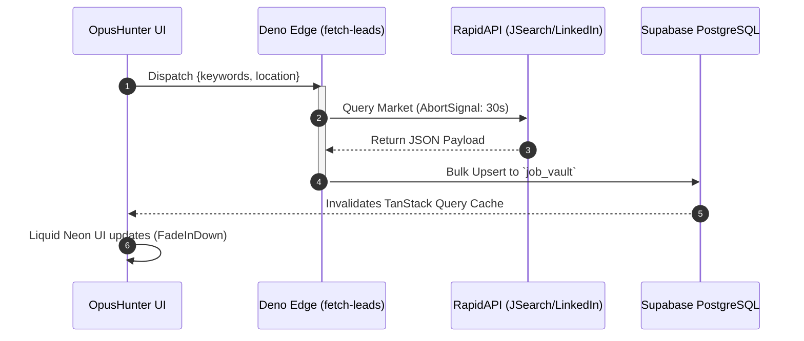
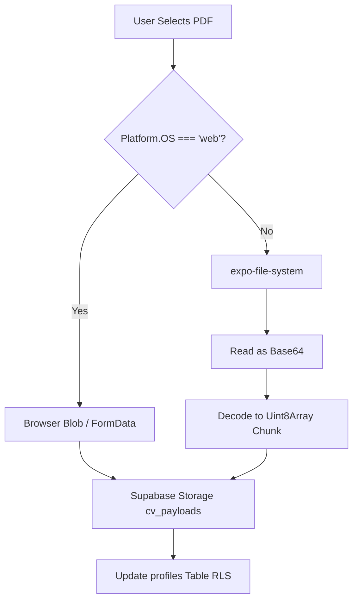
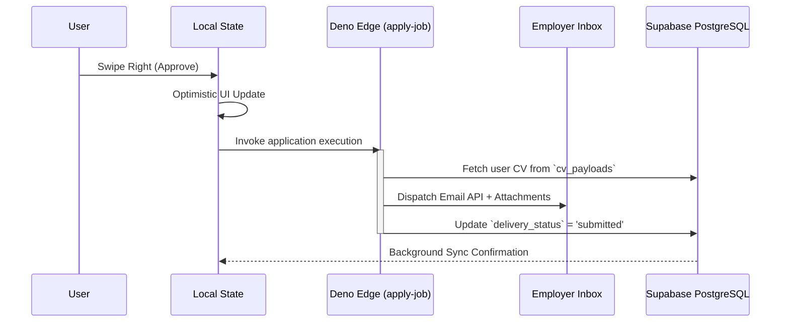

# ⚡ OpusHunter — Automated Career Orchestration Engine

OpusHunter is a high-throughput, cross-platform job aggregation and automated application engine. Engineered with a strict "systems-first" architecture, it bypasses manual UI interactions by piping scraped market data directly into a Supabase-backed Tinder-style evaluation queue.

Approved jobs trigger stateless Deno Edge Functions that autonomously dispatch customized applications and PDF resumes, tracking the entire lifecycle in a secure PostgreSQL vault.

---

## 🏗 System Architecture

### Phase 1: High-Velocity Aggregation Pipeline

OpusHunter circumvents client-side CORS and proxy limitations by executing targeted market sweeps strictly on the Edge. Strict 30-second `AbortSignals` prevent hanging requests during third-party API degradation.

### Phase 2: Dual-Platform CV Vault (Memory-Safe Uploads)

Mobile environments frequently OOM (Out Of Memory) when blindly serializing large PDF buffers. OpusHunter explicitly bifurcates the execution path, treating Web deployments and compiled APKs as distinct environments.

### Phase 3: The Application Routing Engine

Global UI state is hoisted strictly via Zustand, while server state syncs via TanStack Query v5. The UI remains fully non-blocking during swipe gestures.

## 🛡 Strategic Technical Moats

### 1. Zero-Hoisted Component State

To maintain 120fps fluid interactions on mid-tier Android devices, `useState` is heavily restricted.

- **Zustand** orchestrates the global UI shell, active modal overlays, and swipe-gesture states.
- **TanStack Query v5** manages the async server state, caching job lists, and handling optimistic updates upon swipe execution.

### 2. ACID-Compliant Row-Level Security

The engine operates on a multi-tenant architecture secured at the Postgres level. The `job_vault` table and `cv_payloads` storage bucket strictly enforce `auth.uid() = user_id`, guaranteeing that scraped pipelines and binary assets are mathematically isolated.

### 3. Liquid Neon Visual Engine

The UI completely rejects standard backdrop-blur native properties, which are notorious for causing GPU overdraw and layout thrashing in Expo. Instead, depth is simulated via precise opacity layering (`bg-[#0A0A0F]/95`) and reanimated with `withSpring` physics, delivering a high-fidelity "Liquid Neon" aesthetic at zero performance cost.

---

# OpusHunter — Required Asset Files

Drop these files into this `/assets` folder. **Do not use the VeraxAI / maroon
example images** — those were reference screenshots only, showing layout
patterns, not colors. OpusHunter's brand is the cyan / purple / pink palette
already defined in `tailwind.config.js` and `global.css`:

| Token          | Hex       | Usage                                 |
| -------------- | --------- | ------------------------------------- |
| `brand.cyan`   | `#00D4FF` | Primary actions, active states, links |
| `brand.purple` | `#7B5EA7` | Secondary accents, member badges      |
| `brand.pink`   | `#E8436A` | Admin badges, destructive actions     |
| `brand.amber`  | `#F59E0B` | Premium badges, warnings              |
| `brand.green`  | `#00C67D` | Success states                        |

## Required files

| File                           | Size             | Notes                                                                                                                                             |
| ------------------------------ | ---------------- | ------------------------------------------------------------------------------------------------------------------------------------------------- |
| `icon.png`                     | 1024×1024        | App icon (iOS/Android home screen). Used inline in the login logo and sidebar logo button. Transparent or solid `#020507` background, cyan glyph. |
| `favicon.png`                  | 48×48 (or 32×32) | Browser tab icon for web build. Same artwork as `icon.png`, scaled down.                                                                          |
| `adaptive-icon-foreground.png` | 1024×1024        | Android adaptive icon foreground layer — glyph only, transparent background.                                                                      |
| `adaptive-icon-background.png` | 1024×1024        | Android adaptive icon background layer — solid `#020507` or a subtle cyan/purple gradient.                                                        |
| `splash-icon.png`              | 1024×1024        | Splash screen image, shown on `#020507` background per `app.json`.                                                                                |
| `google-logo.png`              | 48×48            | Standard "G" Google logo mark for the OAuth button (publicly available from Google's brand assets — do not redraw).                               |

## Design direction for `icon.png`

A glyph that reads at 16px (favicon scale) and holds up at 1024px (app
store). Suggested: a minimal hawk/radar-style mark — something that nods to
"hunting" — rendered in `#00D4FF` cyan on a `#020507` near-black circular or
squircle backing, with an optional subtle outer glow ring matching
`box-shadow: 0 0 24px rgba(0,212,255,0.25)` from `global.css`'s `.glow-cyan`
utility, so the icon feels consistent with the in-app glow language.

## Where these are used in code

- `app/(auth)/login.tsx` → `require('../../assets/icon.png')` in the logo row
- `app/(tabs)/_layout.tsx` → `require('../../assets/icon.png')` in the sidebar logo button
- `app.json` → `icon`, `favicon`, `adaptiveIcon`, `splash` fields wire these into native + web builds

Once these five files are in place, `npx expo start --web` and `expo prebuild`
will pick them up automatically — no further code changes needed.
